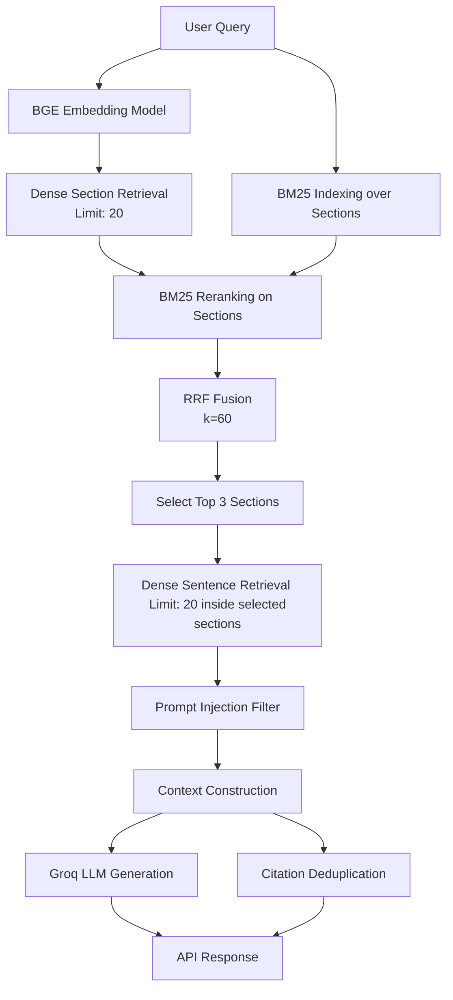

# ClauseScope Retrieval Audit Report (Phase 1)

## Executive Summary
This report presents the findings of a controlled investigation of the ClauseScope retrieval and generation pipeline. The audit was conducted to diagnose why generic summary queries like `"summary of the agreement"` fail (returning a negative fallback response while displaying citations), whereas longer queries like `"for the whole big document can u provide me with the summary???"` behave differently, sometimes generating partial summaries.

Our investigation reveals that:
1. **Scenario 1 is confirmed**: Different query formulations retrieve completely different sections (different query $\rightarrow$ different retrieval $\rightarrow$ different answer).
2. **Boilerplate vs. Substantive Retrieval**: The short query retrieved administrative boilerplate sections (governing law, termination), whereas the longer query retrieved substantive sections (duties, compensation) due to keyword triggers in BM25.
3. **Strict LLM Adherence**: Under the larger `llama-3.3-70b-versatile` model, both queries fail to generate a comprehensive summary because the context is limited to only 3 sections. The model strictly obeys the prompt instruction to return the negative fallback when information is insufficient.
4. **Citation Inconsistency**: Citations are generated strictly from the retrieved chunks in the `citation_node`, completely independent of the LLM generator's output. The frontend renders these citations unconditionally, leading to the "No evidence found but sources displayed" anomaly.

---

## Current Retrieval Architecture

The ClauseScope RAG pipeline uses a hierarchical retrieval strategy structured as follows:



* **Parsing**: Handled via Docling to extract structured text and layout.
* **Chunking**: Chunked hierarchically into `SectionChunk` (using a fallback of 10 tokens for small documents and target of 50 tokens) and `SentenceChunk`.
* **Retrieval**: Two-step search:
  1. Dense section retrieval query against Qdrant (`legal_sections`) returning top 20 hits.
  2. BM25 keyword matching across the text of those 20 sections.
  3. Reciprocal Rank Fusion (RRF) with $k=60$ to combine dense and sparse rankings. The top 3 sections are selected.
  4. Dense sentence retrieval query against Qdrant (`legal_sentences`) limited to `top_sentences` (20 hits) and filtered to the selected 3 section IDs.
* **Generation**: Context is formatted as structured document, section, and page blocks and sent to Groq (`llama-3.3-70b-versatile` or fallback `llama-3.1-8b-instant`) with `temperature=0` using `LEGAL_QA_PROMPT`. The prompt strictly commands:
  *"If the answer is not contained in the context, respond exactly with: 'I could not find sufficient evidence in the provided documents.'"*
* **Citations**: Extracted in `citation_node` by deduplicating `(page_num, heading)` from the list of retrieved sentence chunks.

---

## Findings

### 1. Query Comparison Results (Query A vs. Query B)
Running both queries against the same document (`ArcaUsTreasuryFund` Development Agreement) confirmed **Scenario 1**: different queries result in different section selections, resulting in different contexts and answers.

| Metric | Query A: `"summary of the agreement"` | Query B: `"for the whole big document can u provide me with the summary???"` |
| :--- | :--- | :--- |
| **Top 3 Sections** | 1. Section 10: Entire Agreement<br>2. Section 7: Duration and Termination<br>3. Preamble (ARCA CAPITAL MANAGEMENT) | 1. Section 1: Duties of the Blockchain Administrator<br>2. Section 4: Compensation & Costs<br>3. Preamble (ARCA CAPITAL MANAGEMENT) |
| **Pages Covered** | Pages 1, 3, 4 | Pages 1, 2 |
| **Context Nature** | Purely administrative boilerplate | Highly substantive (services, fees) |
| **70B LLM Answer** | `"I could not find sufficient evidence..."` | `"I could not find sufficient evidence..."` |
| **8B LLM Answer** | Succeeded (generated summary of boilerplate) | Succeeded (generated summary of duties and fees) |

* **Why Query A retrieved boilerplate**: The word `"agreement"` is highly prevalent in Section 10 (`"Entire Agreement"`) and Section 7 (`"Duration and Termination of this Agreement"`). The dense vector matched these heavily.
* **Why Query B retrieved substantive sections**: The conversational words `"document"`, `"provide"`, and `"summary"` shifted the BM25 keyword scores. Section 1 (`"Duties"`) contains occurrences of these helper words, raising its BM25 score to **4.08** (vs. **1.61** for Query A) and pushing it to Rank 1 via RRF Fusion.

### 2. Similarity Score Findings
* **Semantic Dilution**: Conversational queries (Query B) suffer from semantic dilution. The maximum dense similarity score for Query B was **0.613**, whereas Query A (short and focused) achieved **0.675**. Conversational noise weakens dense matching.
* **BM25 Dominance**: BM25 keyword scores heavily override dense rankings in RRF. For example, Section 1 had a dense rank of 2 (0.589) for Query B, but because of its high BM25 score (4.08, Rank 1), it secured the top spot in the final fusion ranking.
* **No Score Filtering**: There is no similarity threshold filtering. The pipeline retrieves the top 3 sections and 20 sentences unconditionally, even if the similarity scores are extremely low (e.g. dense scores of **0.51** were retrieved and passed to the LLM).

### 3. Summary Query Findings
* **Success Cases**: Summary queries succeed on **Small Documents** (e.g., `beta_contract.pdf` with 1 chunk) because 100% of the document fits inside that single retrieved chunk. The LLM has the complete text.
* **Failure Cases**: Summary queries fail on **Medium/Large Documents** because the retrieval depth is hard-capped at 3 sections. The LLM is given less than 15% of the document's content, which makes a comprehensive summary impossible.
  * *Strict models (70B)* strictly return the negative fallback because they recognize they lack the full agreement text.
  * *Less strict models (8B)* try to summarize anyway, producing biased, incomplete summaries based only on the few retrieved sections.

### 4. Citation Findings & Root Cause Analysis
We traced the full execution path of a negative fallback response:
1. **Retrieval**: 6 sentences are retrieved.
2. **Generation**: LLM output is `"I could not find sufficient evidence..."` because the context is insufficient.
3. **Citation Construction**: `citation_node` extracts citations from the 6 retrieved sentences, creating 3 source objects.
4. **API Response**: Backend merges them and returns:
   ```json
   {
     "answer": "I could not find sufficient evidence in the provided documents.",
     "citations": [
       { "document": "...", "page": 4, "section": "..." }
     ]
   }
   ```
5. **Frontend Rendering**: In `MessageBubble.jsx`, the citations block is rendered unconditionally:
   ```javascript
   {citationCount > 0 && <div className="bg-slate-50/40 p-4 border-t...">Citations</div>}
   ```
   Because the backend returns citations, the frontend renders them.
6. **Frontend State Check**: Scoped per message. The frontend does not leak stale citations from previous queries; rather, the current query itself contains citations despite yielding no answer.

### 5. Retrieval/Coverage Findings
Standard QA retrieval is highly localized. Below is the page coverage distribution for PelicanDeliversInc (14 pages, 37 sections) under different queries:
* `"summary of the agreement"` $\rightarrow$ Pages **13, 14** (Pages 1-12 missing)
* `"summarize this document"` $\rightarrow$ Pages **9, 13** (Pages 1-8, 10-12, 14 missing)
* `"provide a summary"` $\rightarrow$ Pages **2, 3, 6** (Pages 1, 4-5, 7-14 missing)
* `"for the whole big document..."` $\rightarrow$ Pages **2, 7, 13** (Pages 1, 3-6, 8-12, 14 missing)

Retrieval is highly biased toward a narrow window of 2 to 3 pages that happen to match the embedding vector, leaving the rest of the document completely unrepresented.

---

## Recommendations

We rank the recommended improvements by their expected impact on solving summary query failures and citation anomalies:

### 1. Backend Citation Filtering (High Impact, Low Effort)
* **Goal**: Prevent displaying citations when the LLM returns the negative fallback answer.
* **Implementation**: In the `citation_node` (or in `chain.py`), check if the generated answer is exactly the negative fallback (`"I could not find sufficient evidence in the provided documents."`). If so, clear the citations array (`citations = []`) before returning.

### 2. Query Routing / Classification (High Impact, Medium Effort)
* **Goal**: Detect if a query is a summary/overview query vs. a fact-based query.
* **Implementation**: Add a lightweight classification node at the start of the LangGraph. If the query is classified as a "Summary Query", route to a summary-specific retrieval strategy. If it is a "Fact Query", route to the current HierarchicalRetriever.

### 3. Summary-Specific Retrieval Strategy (High Impact, High Effort)
* **Goal**: Provide the LLM with document-wide context instead of 3 localized sections.
* **Implementation**:
  * **Option A (Document Summaries)**: During document ingestion, generate a comprehensive document summary using the LLM and store it as a special document-level metadata chunk. When a summary query is routed, retrieve this pre-generated summary chunk directly.
  * **Option B (MapReduce Retrieval)**: Retrieve a representative sentence/chunk from *every* section of the document, or use hierarchical summarization to compile the summary in parallel.

### 4. Query Rewriting / Conversational Noise Strip (Medium Impact, Medium Effort)
* **Goal**: Clean conversational filler to improve dense matching and resolve vocabulary mismatch.
* **Implementation**: Use a lightweight LLM call or regex to rewrite the query.
  * Convert: `"for the whole big document can u provide me with the summary???"` $\rightarrow$ `"summary of document"`
  * Expand: `"What is the designer's hourly rate?"` $\rightarrow$ `"What is the designer's or developer's hourly rate or compensation?"` (mapping "designer" to "developer" based on document vocabulary).

### 5. Similarity Threshold Filtering (Medium Impact, Low Effort)
* **Goal**: Prevent passing low-quality, irrelevant sections to the LLM.
* **Implementation**: Set a minimum dense similarity score threshold (e.g. `score >= 0.55`) in the retriever. Discard chunks below the threshold to prevent noisy contexts from confusing the LLM.
